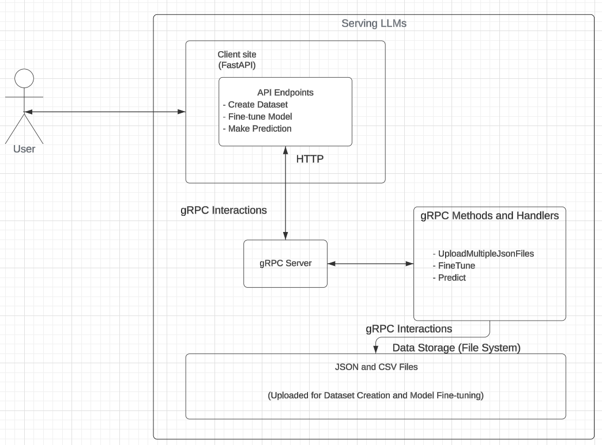

# API Usage Guide for Llama Service

## Introduction
This guide provides instructions on how to use the Llama Service API for tasks such as creating datasets, fine-tuning models, and making predictions. The API allows interaction with Llama models via gRPC and FastAPI.

## Infrastructure diagram



## Prerequisites
Before using the Llama Service API, ensure you have the following:

- Python installed on your system.
- Docker installed (optional, for containerized deployment).
- Access to the necessary input data for dataset creation, fine-tuning, and prediction.

## Setting Up the Environment
To set up the environment for using the Llama Service API, follow these steps:

1. Clone the repository containing the API code.
2. Install the required dependencies listed in the `requirements.txt` file using `pip install -r requirements.txt`.
3. Open two terminal with setuped dependencies above. Run `python server.py` and `python client.py`
4. Using browser to access endpoints `http://localhost:8000/docs`
## Steps to Run via Docker

1. **Build the Docker Image**: Navigate to the directory containing the Llama Service API code and the Dockerfile. Use the following command to build the Docker image:
```bash
    docker build -t llama-service .
```

This command builds a Docker image named llama-service based on the provided Dockerfile.

Run the Docker Container: After successfully building the Docker image, you can run a Docker container using the following command:
```bash
    docker run -d -p 8000:8000 llama-service
```
This command starts a Docker container named `llama-service` in detached mode (-d), mapping port 8000 on the host system to port 8000 inside the container.

2. **Access the API**: Once the Docker container is running, you can access the Llama Service API using HTTP requests. For example, if the API is running locally, you can send requests to http://localhost:8000.

### Docker Compose (Optional)
If you prefer using Docker Compose for managing multi-container Docker applications, you can use the provided `docker-compose.yml` file. Simply run the following command in the directory containing the `docker-compose.yml` file:
```bash
docker-compose up -d
```

## Using the API Endpoints

### 1. Creating Datasets

#### Endpoint:
```
POST /create-dataset
```

#### Request:
- **files**: List of JSON files to upload for dataset creation.

#### Response:
- **Success**: Returns a JSON response indicating the success of dataset creation along with a message specifying the location where the dataset is saved.

### 2. Fine-tuning Models

#### Endpoint:
```
POST /fine-tune
```

#### Request:
- **file**: CSV file containing data for fine-tuning the model.

#### Response:
- **Success**: Returns a JSON response indicating the completion status of fine-tuning along with any relevant logs.

### 3. Making Predictions

#### Endpoint:
```
POST /predict
```

#### Request:
- **prompt**: Prompt for which a prediction is to be made.

#### Response:
- **Success**: Returns a JSON response containing the generated text based on the provided prompt.

## Example Usage

### 1. Creating a Dataset
```python
import requests

url = "http://localhost:8000/create-dataset"
files = [("files", ("test_1.json", open("test_1.json", "rb"), "application/json")),
         ("files", ("test_2.json", open("test_2.json", "rb"), "application/json"))]

response = requests.post(url, files=files)
print(response.json())
```

### 2. Fine-tuning a Model
```python
import requests

url = "http://localhost:8000/fine-tune"
file = {"file": open("data.csv", "rb")}

response = requests.post(url, files=file)
print(response.json())
```

### 3. Making Predictions
```python
import requests

url = "http://localhost:8000/predict"
data = {"prompt": "What is the meaning of life?"}

response = requests.post(url, json=data)
print(response.json())
```